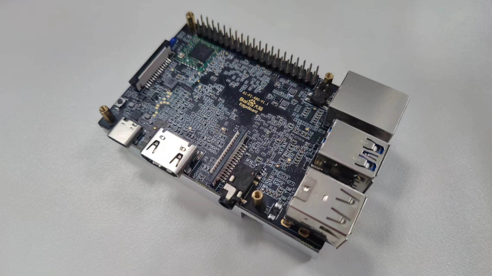
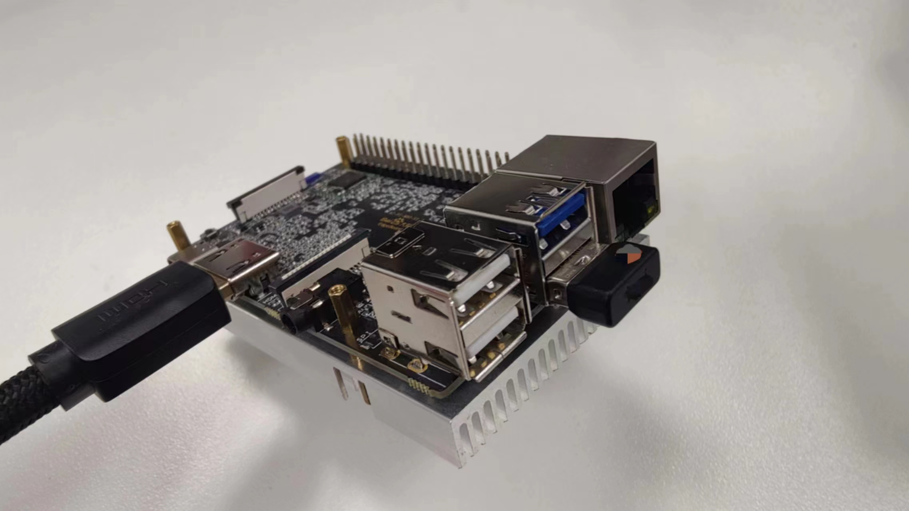
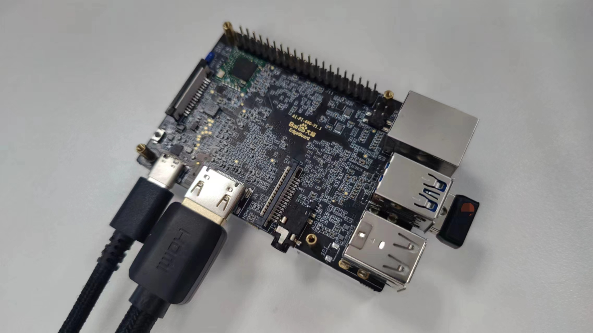
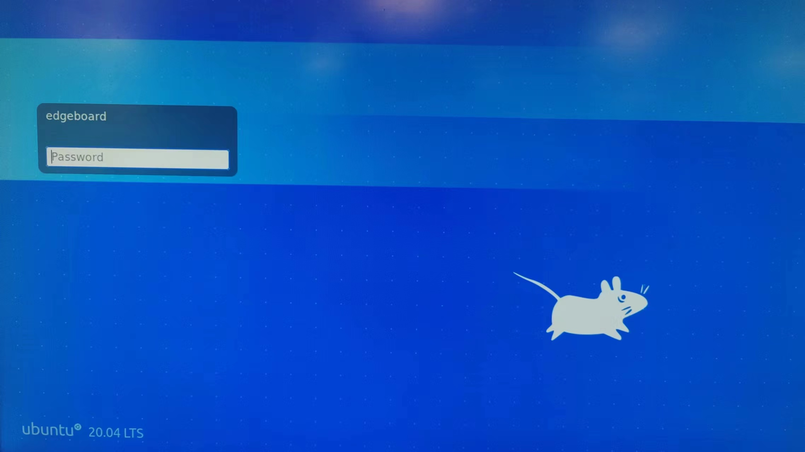
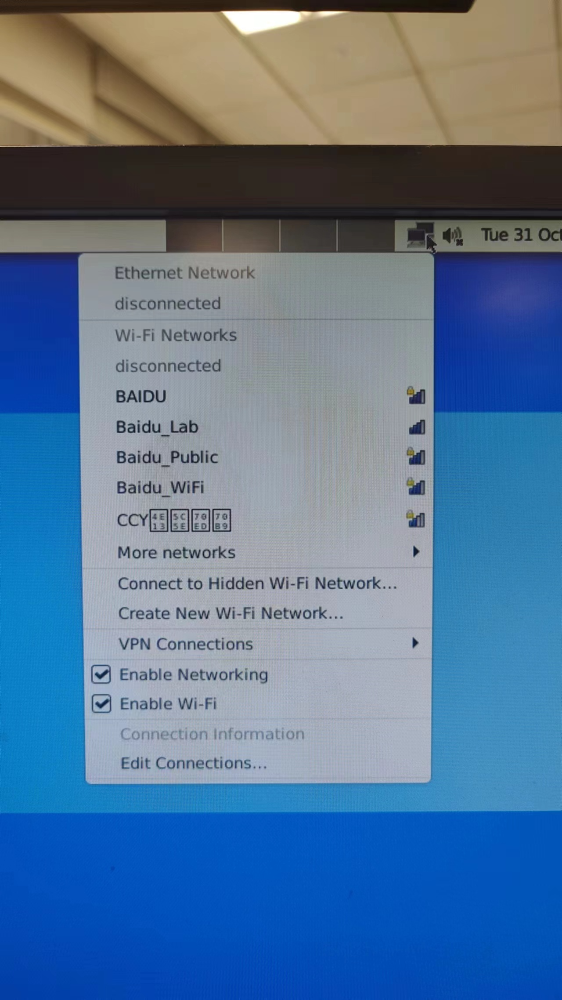
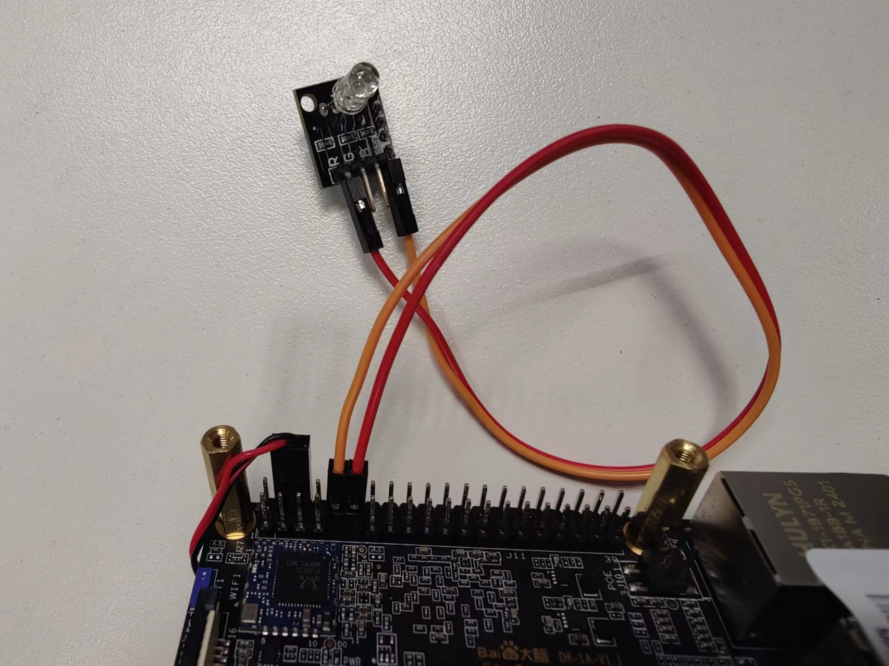

# 快速开始



本节介绍EdgeBoard DK-1A开发板的简单流程，方便大家快速了解，具体问题详见相关章节展开。

## 连接显示器


使用HDMI接口的连接线一端连接板卡，另一端连接显示器。

## 连接键盘鼠标



将USB-TypeA接口的有线鼠标键盘接入板卡，也可使用无线键鼠的USB-TypeA接口的无线收发器接入板卡中。
本例中使用键鼠一体的USB-TypeA的无线收发器。

## 连接电源



使用5V3A电源适配器，将Type-C接口电源线接入板卡，并连接电源。板卡默认通电后自行启动。

## 登录桌面



使用如下初始账号密码登录桌面。

> 账户：EdgeBoard<br>
> 密码：1234

键入密码后，回车登录桌面。

## 连接网络

EdgeBoard DK-1A可使用有线，或者使用WI-FI连接网络。

### 有线连接


EdgeBoard DK-1A板卡板载10/100/1000Mbps自适应网卡。可通过RJ-45接口连接有线网络。

### WI-FI连接



EdgeBoard DK-1A板卡板载Wi-Fi芯片，支持连接2.4G/5G无线网络。
可在桌面右上角，点击网络图标，选择连接网络。

## GPIO使用

### 例：点亮LED

本例中，将LED的GND端连接在PIN6（GND）引脚上，将LED的R端连接在PIN7引脚上（LED模块上自带了1kΩ的电阻），编程控制PIN7为输出引脚，并输出高低电平来控制LED亮灭。连接如下图所示：



打开一个终端，执行如下命令：

```shell
gpio mode 7 out        # 设置GPIO7为输出引脚
```

执行如下命令：

```shell
gpio write 7 1         # 设置GPIO7输出高电平
```

LED被点亮。

执行如下命令：

```shell
gpio write 7 0         # 设置GPIO7输出低电平
```

LED熄灭。

更加详细GPIO使用说明，请参考[接口介绍](./接口介绍.md)的GPIO章节。

## AI模型推理使用

本例中，使用目标检测模型，识别图片中的内容。概要流程如下：


### 模型获取

此处使用已经训练好的模型，详情可参考[模型推理](./模型推理.md)中的模型生产章节。

### 模型部署

### 模型推理
