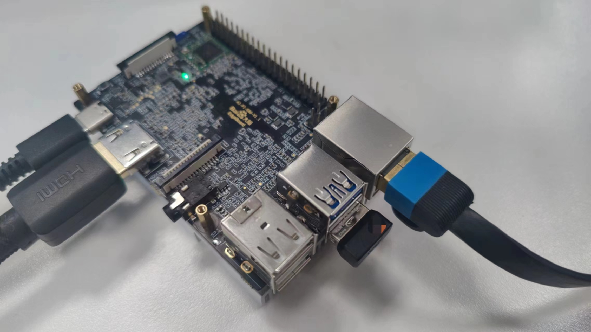

# 快速开始


本节介绍EdgeBoard DK-1A开发板的简单流程，方便大家快速了解，具体问题详见相关章节展开。

## 连接显示器


使用HDMI接口的连接线一端连接板卡，另一端连接显示器。

## 连接键盘鼠标


将USB-TypeA接口的有线鼠标键盘接入板卡，也可使用无线键鼠的USB-TypeA接口的无线收发器接入板卡中。
本例中使用键鼠一体的USB-TypeA的无线收发器。

> 注：使用2.4GHz无线接收器时，建议优先接入USB2.0（内为白色端子）接口，可进一步防止干扰。

## 连接电源


使用5V3A电源适配器，将Type-C接口电源线接入板卡，并连接电源。板卡默认通电后自行启动。

## 登录桌面


使用如下初始账号密码登录桌面。

> 账户：EdgeBoard  
> 密码：1234

键入密码后，回车登录桌面。

## 连接网络

EdgeBoard DK-1A可使用有线，或者使用WI-FI连接网络。

### 有线连接



EdgeBoard DK-1A板卡板载10/100/1000Mbps自适应网卡。可通过RJ-45接口连接有线网络。

### WI-FI连接


EdgeBoard DK-1A板卡板载Wi-Fi芯片，支持连接2.4G/5G无线网络。
可在桌面右上角，点击网络图标，选择连接网络。

## GPIO使用

### 例：点亮LED

本例中，将LED的GND端连接在PIN6（GND）引脚上，将LED的R端连接在PIN7引脚上（LED模块上自带了1kΩ的电阻），编程控制PIN7为输出引脚，并输出高低电平来控制LED亮灭。连接如下图所示：


相应原理图如下：


打开一个终端，执行如下命令：

```shell
sudo apt-get update         # 更新apt软件源
sudo apt install wiringpi   # 安装wiringpi库
```

```shell
gpio mode 7 out             # 设置GPIO7为输出引脚
```

执行如下命令：

```shell
gpio write 7 1              # 设置GPIO7输出高电平
```

LED被点亮。

执行如下命令：

```shell
gpio write 7 0              # 设置GPIO7输出低电平
```

LED熄灭。

更加详细GPIO使用说明，请参考[接口介绍](./接口介绍.md)的GPIO章节。

## AI模型推理使用

EdgeBoard DK-1A板卡具有强大的AI推理能力，支持多种AI模型。下面以目标检测为例，重点介绍EdgeBoard DK-1A板卡的AI推理使用。

### 例：图片分类

本例中，使用分类模型，识别图片中主体，并使用既定编号标出其所属类别。测试前后效果对比如下图所示：


> label = 757 即为识别为救护车类别。757映射救护车为项目数据集预设。

#### 模型获取

此处使用已经训练好的模型，详情可参考[模型推理](./模型推理.md)中的模型生产描述。

该模型基于项目[PaddleClas](https://aistudio.baidu.com/projectdetail/7153172)训练产出、评估和导出(版本参考：ver23.11.28 2023-11-28 19:04:02)。并经过百度技术支持完成高性能转化。

可在终端中执行如下命令，下载范例模型文件及相关物料：

```shell
cd /home/edgeboard/Downloads
sudo wget https://picodet.bj.bcebos.com/models/picodet_s_320_pedestrian
```

#### 模型部署

首先将模型生产阶段产生的xx.tar模型文件传输至板卡，置于./model文件夹

执行以下命令激活虚拟环境：

```shell
source env/bin/activate
```

> 注：虚拟环境，xxxx补充解释作用。

切换到/home/edgeboar/picodet目录

```shell
cd /home/edgeboar/picodet
```

运行推理案例

```shell
python3 tools/infer_demo.py --config ./model/config.json --test_image ./test_images/73.jpg --visualize True --with_profile True
```

可在./output_dir目录下找到推理结果图片paddle_result_images等其他输出结果文件：


退出当前虚拟环境，执行以下命令：

```shell
deactivate
```
