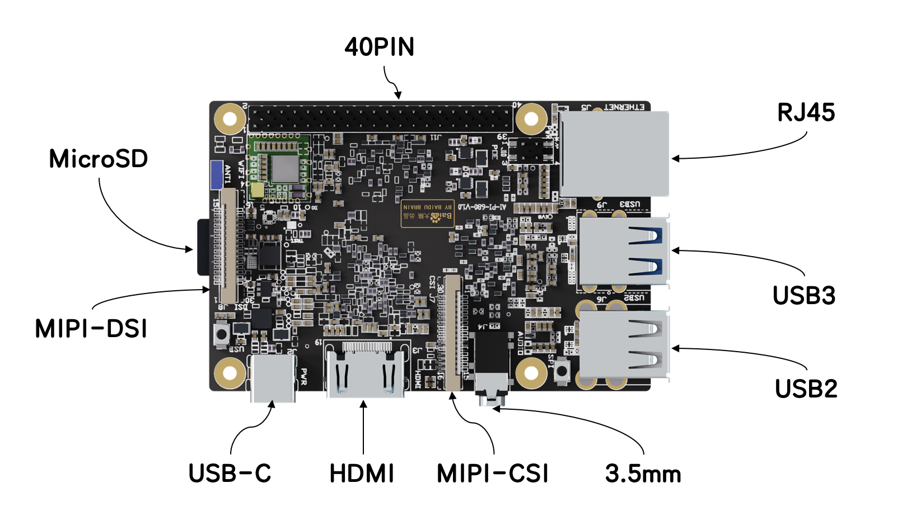
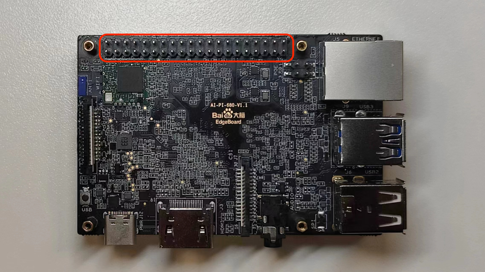

# 板卡接口



EdgeBoard DK-1配置接口丰富。提供40PIN扩展接口（含GPIO、UART、PWM、I2C、SPI）、RJ45网口、USB接口、全尺寸HDMI接口、3.5mm音频接口、MIPI接口的相机/显示屏接口等。

## 40PIN接口

### 接口简介

40PIN接口是EdgeBoard DK-1A为方便嵌入式系统项目开发、快速搭建原型机而提供的扩展接口，使用40PIN接口可以方便的接入各种传感器、模块。




<table>
    <thead>
        <tr>
            <th>WiringPi 编码</th>
            <th>alt1 func</th>
            <th>default func</th>
            <th colspan="2">物理引脚BOARD编码</th>
            <th>default func</th>
            <th>alt1 func</th>
            <th>WiringPi 编码</th>
        </tr>
    </thead>
    <tbody>
        <tr>
            <td></td>
            <td></td>
            <td>3.3V</td>
            <td>1</td>
            <td>2</td>
            <td>5V</td>
            <td></td>
            <td></td>
        </tr>
        <tr>
            <td></td>
            <td>GPIO46</td>
            <td>SDA0</td>
            <td>3</td>
            <td>4</td>
            <td>5V</td>
            <td></td>
            <td></td>
        </tr>
        <tr>
            <td></td>
            <td>GPIO47</td>
            <td>SCL0</td>
            <td>5</td>
            <td>6</td>
            <td>GND</td>
            <td></td>
            <td></td>
        </tr>
        <tr>
            <td>7</td>
            <td>TXD3</td>
            <td>GPIO42</td>
            <td>7</td>
            <td>8</td>
            <td>TXD0</td>
            <td>GPIO19</td>
            <td></td>
        </tr>
        <tr>
            <td></td>
            <td></td>
            <td>GND</td>
            <td>9</td>
            <td>10</td>
            <td>RXD0</td>
            <td>GPIO18</td>
            <td></td>
        </tr>
        <tr>
            <td>0</td>
            <td></td>
            <td>GPIO8</td>
            <td>11</td>
            <td>12</td>
            <td>GPIO38</td>
            <td>PWM1</td>
            <td>1</td>
        </tr>
        <tr>
            <td>2</td>
            <td></td>
            <td>GPIO9</td>
            <td>13</td>
            <td>14</td>
            <td>GND</td>
            <td></td>
            <td></td>
        </tr>
        <tr>
            <td>3</td>
            <td></td>
            <td>GPIO10</td>
            <td>15</td>
            <td>16</td>
            <td>GPIO37</td>
            <td></td>
            <td>4</td>
        </tr>
        <tr>
            <td></td>
            <td></td>
            <td>3.3V</td>
            <td>17</td>
            <td>18</td>
            <td>GPIO36</td>
            <td></td>
            <td>5</td>
        </tr>
        <tr>
            <td></td>
            <td>GPIO50</td>
            <td>SPI1_SDO</td>
            <td>19</td>
            <td>20</td>
            <td>GND</td>
            <td></td>
            <td></td>
        </tr>
        <tr>
            <td></td>
            <td>GPIO48</td>
            <td>SPI1_SDI</td>
            <td>21</td>
            <td>22</td>
            <td>GPIO40</td>
            <td></td>
            <td>6</td>
        </tr>
        <tr>
            <td></td>
            <td>GPIO49</td>
            <td>SPI1_SCLK</td>
            <td>23</td>
            <td>24</td>
            <td>SPI1_CS0</td>
            <td>GPIO54</td>
            <td></td>
        </tr>
        <tr>
            <td></td>
            <td></td>
            <td>GND</td>
            <td>25</td>
            <td>26</td>
            <td>SPI1_CS1</td>
            <td>GPIO53</td>
            <td></td>
        </tr>
        <tr>
            <td></td>
            <td>GPIO10</td>
            <td>SDA3</td>
            <td>27</td>
            <td>28</td>
            <td>SCL3</td>
            <td>GPIO9</td>
            <td></td>
        </tr>
        <tr>
            <td>21</td>
            <td>RXD3</td>
            <td>GPIO43</td>
            <td>29</td>
            <td>30</td>
            <td>GND</td>
            <td></td>
            <td></td>
        </tr>
        <tr>
            <td>22</td>
            <td></td>
            <td>GPIO12</td>
            <td>31</td>
            <td>32</td>
            <td>PWM0</td>
            <td>GPIO39</td>
            <td>26</td>
        </tr>
        <tr>
            <td>23</td>
            <td>GPIO16</td>
            <td>PWM2</td>
            <td>33</td>
            <td>34</td>
            <td>GND</td>
            <td></td>
            <td></td>
        </tr>
        <tr>
            <td>24</td>
            <td>PWM3</td>
            <td>GPIO15</td>
            <td>35</td>
            <td>36</td>
            <td>GPIO41</td>
            <td></td>
            <td>27</td>
        </tr>
        <tr>
            <td>25</td>
            <td></td>
            <td>GPIO13</td>
            <td>37</td>
            <td>38</td>
            <td>GPIO21</td>
            <td></td>
            <td>28</td>
        </tr>
        <tr>
            <td></td>
            <td></td>
            <td>GND</td>
            <td>39</td>
            <td>40</td>
            <td>GPIO11</td>
            <td></td>
            <td>29</td>
        </tr>
    </tbody>
</table>

> <mark>注意：</mark><br>
> 1.Pin19、Pin24作为GPIO时仅支持输出模式，不能作为输入接口；<br>
> 2.Pin8、Pin10默认为系统debug接口，会打印输出相关log信息；

<table>
    <thead>
        <tr>
        <td>功能</td>
        <td>引脚</td>
        </tr>
    </thead>
    <tbody>
        <tr>
        <td>UART</td>
        <td>UART0_Debug_TX:PIN8(GPIO19)<br>
        UART0_Debug_RX:PIN10(GPIO18)<br>
        UART3_TX:PIN7(GPIO42)<br>
        UART3_RX:PIN29(GPIO43)
        </td>
        </tr>
        <tr>
        <td>PWM</td>
        <td>PMM0:PIN8(GPIO39)<br>
        PWM1:PIN12(GPIO38)<br>
        PWM2:PIN33(GPIO33)<br>
        PWM3:PIN35(GPIO35)</td>
        </tr>
        <tr>
        <td>I2C</td>
        <td>I2C0_Data:PIN3（GPIO46）<br>
        I2C0_Clock:PIN5（GPIO47）<br>
        I2C3_EEPROM_Data:PIN27（GPIO10）<br>
        I2C3_EEPROM_Clock:PIN28（GPIO9）</td>
        </tr>
        <tr>
        <td>SPI</td>
        <td>SPI1_MOSI:PIN21（GPIO48）<br>
        SPI1_MISO:PIN19（GPIO50）<br>
        SPI1_SCLK:PIN23（GPIO49）<br>
        SPI1_CS0:PIN24（GPIO54）<br>
        SPI1_CS1:PIN26（GPIO53）
        </td>
        </tr>
    </tbody>
</table>

### 方案简介

#### WiringPi方案

EdgeBoard DK-1A默认预装WiringPi库
WiringPi是一个用C语言编写的树莓派（Raspberry Pi）软件包，它WiringPi是一个用C语言编写的树莓派（Raspberry Pi）软件包，它主要用于树莓派的GPIO引脚控制、串口通信、SPI通信及I2C通信等功能。这个库函数遵守GUN Lv3，并且由C或者C++开发，同时还可以转换为其他语言，例如python、ruby或者PHP等。WiringPi官方网站[WiringPi官网](http://wiringpi.com/)，非官方python版本[WiringPi-Python](https://github.com/WiringPi/WiringPi-Python)。<br>
为方便广大开发者快速使用，百度在EdgeBoard DK-1A上适配了WiringPi库，但由于底层硬件不完全一致，仍有部分差异，详细适配情况详见下表：


<https://ku.baidu-int.com/knowledge/HFVrC7hq1Q/tMiPEdE8mS/TzB3DauUar/RYcmLJruRbMcCl>

<table>
    <thead>
    <tr>
    <td>接口</td>
    <td>GPIO</td>
    </tr>
    </thead>
    <tbody>
    <tr>
    <td>接口</td>
    <td>GPIO</td>
    </tr>
    </tbody>
</table>

### WiringPi使用

#### WiringPi安装

打开终端，输入以下命令安装WiringPi库。

```shell
sudo apt-get install wiringpi
```

可使用以下命令查看WiringPi版本，验证是否安装成功。

```shell
gpio -v
```

如打印WiringPi版本信息，则安装成功。

#### WiringPi接口调用

##### GPIO

使用wiringPi编码方式进行初始化

```shell
wiringPiSetup()
```

控制接口输入输出模式

```shell
pinMode(int pin , int mode)
```

mode INPUT\OUTPUT\

<table>
    <thead>
        <tr>
            <td>接口</td>
            <td>GPIO</td>
        </tr>
    </thead>
    <tbody>
        <tr>
            <td>接口</td>
            <td>GPIO</td>
        </tr>
        <tr>
            <td>接口</td>
            <td>GPIO</td>
        </tr>
        <tr>
            <td>接口</td>
            <td>GPIO</td>
        </tr>
        <tr>
            <td>接口</td>
            <td>GPIO</td>
        </tr>
    </tbody>
</table>


##### UART

##### PWM

###### HardPWM

###### SoftPWM

###### SoftTone

###### 中断Interruput

##### I2C

##### SPI

PIN 19: SPI0_SDO
PIN 21: SPI0_SDI
PIN 23: SPI0_CLK
PIN 24: SPI0_CS0
PIN 25: SPI0_CS1


### 其它工具

#### i2c-tools

i2c-tools是Linux下的一个I2C工具，可以用来检测I2C设备。

i2c-tools的安装：

```python
sudo apt-get install i2c-tools
```

i2c-tools的使用：
如查看总线已挂载从设备：

```python
i2cdetect -y -a -r 0 
```

其中0表示0号I2C总线，若设备连接到pin3和pin5上即为0，若连接到pin27和pin28上即为3。
i2ctools的详细用法可参见：<https://cloud.tencent.com/developer/article/2009823>

#### python smbus2库

smbus2是python的一个I2C库，可以用来检测I2C设备。
smbus2的安装：

```python
pip install smbus2
```

smbus2的使用参考：<https://pypi.org/project/smbus2/>

#### spi-tools

spi-tools是Linux下的一个SPI工具，可以用来检测SPI设备。
spi-tools的安装：

```python
sudo apt install spi-tools
```

spi-tools的使用：查看设备：

```python
spi-config -d /dev/spidev0.0 -q
```

spi-tools的详细用法可参见：[spi-tools](https://github.com/cpb-/spi-tools)

#### spidev工具

安装spidev库

```shell
pip install spidev
```

spidev库详细使用参考：[spidev库](https://pypi.org/project/spidev/)

## RJ45接口


EdgeBoard DK-1A提供1个RJ45接口，通过RJ45接口可连接网络。

## USB接口


EdgeBoard DK-1A提供2个TypeA型USB2.0和2个TypeA型USB3.0接口。

## 3.5mm音频接口


EdgeBoard DK-1A提供3.5mm音频接口。
3.5mm音频接口使用4极CTIA Standard标准，线序为从尖端到根部依次是左声道、右声道、电源地、麦克风，可参考下图：


## MIPI接口-CSI


EdgeBoard DK-1A提供1个MIPI接口(2lane)，可通过MIPI接口连接CSI摄像头。

## HDMI接口


EdgeBoard DK-1A提供1个全尺寸HDMI视频输出接口。

## TypeC接口


EdgeBoard DK-1A提供1个TypeC接口，用于设备供电。供电建议为5V3A。可使用USB TypeC接口的电源适配器或者符合电压电流输出要求的充电宝等进行供电。

## MIPI接口-DSI


EdgeBoard DK-1A提供1个MIPI接口(2lane)，可通过MIPI接口连接DSI显示屏。
