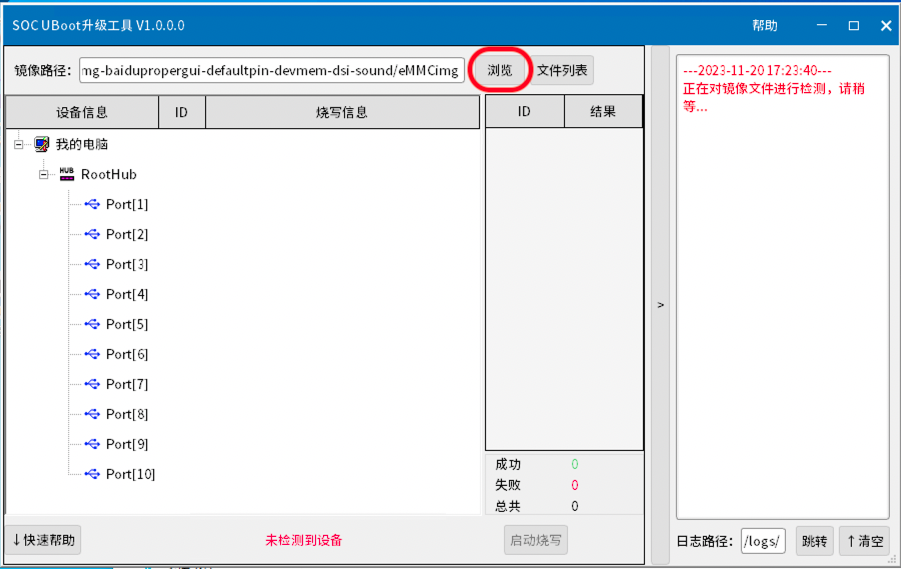
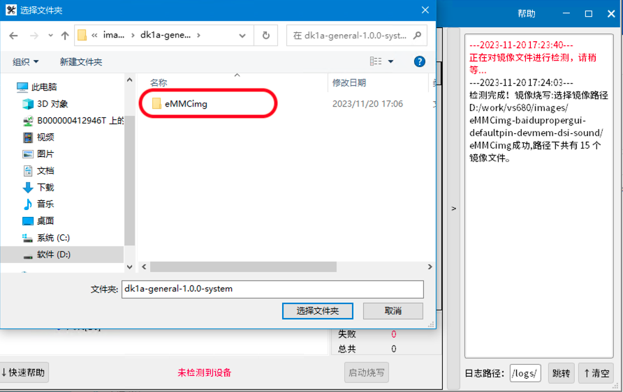
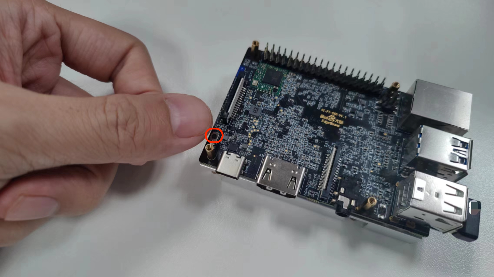
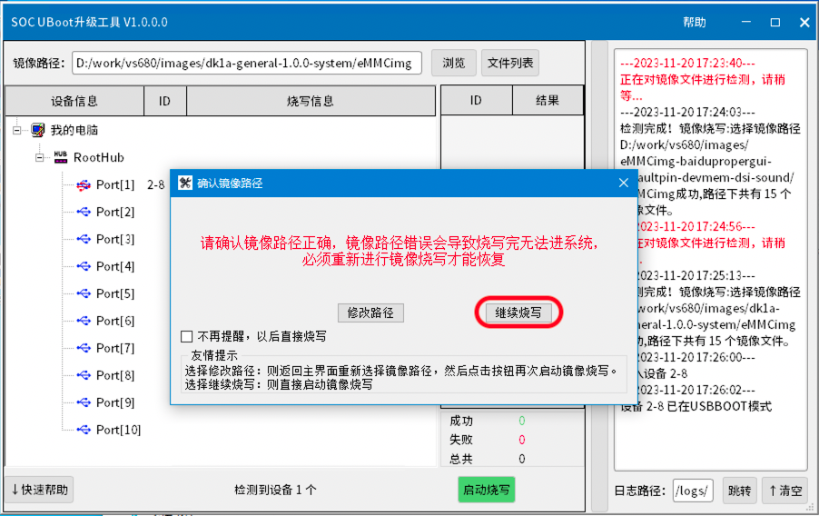
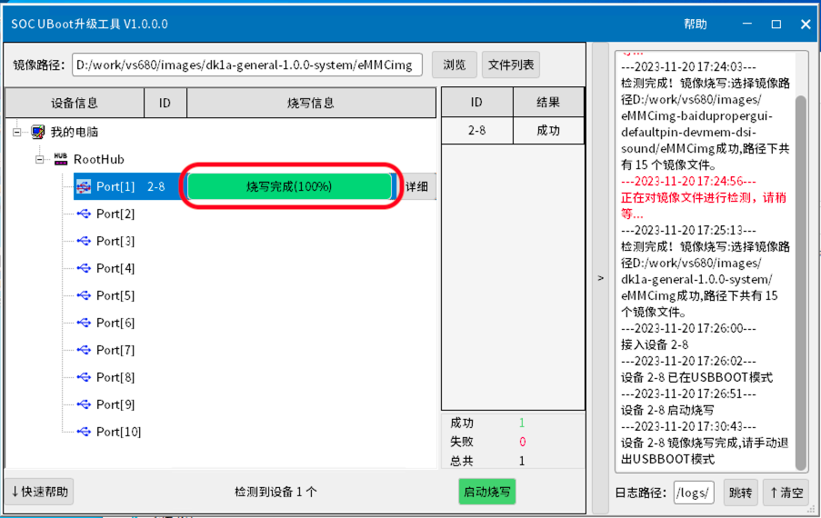
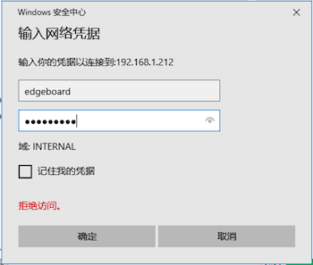
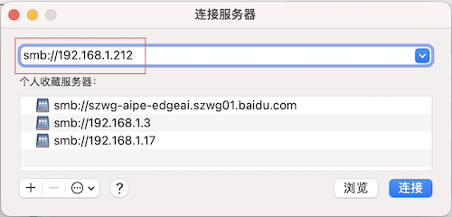

# 系统相关

默认内置系统：Ubuntu 20.04

## 系统镜像烧写

默认版本内置系统镜像

### 准备工作

- 系统烧录工具 **SOC UBoot升级工具 V1.0.0.0** ，点击[此处](https://pp-os.bj.bcebos.com/vs680/tools/burn/SenarySocUpdateToolSetupV1.0.0.0.exe)下载；  
- 更新镜像文件，下载地址[PPOSv1.0](https://pp-os.bj.bcebos.com/vs680/system/dk1a-general-1.0.0-system.tgz) MD5：673724fb20c2bcc08a81c2b99e6d3590 ，并解压。

### Step1

双击打开系统烧录工具 **SOC UBoot升级工具 V1.0.0.0** ，点击 **浏览** 按钮。



### Step2

在弹出的对话框中，选择解压后获得的更新镜像的文件夹 **eMMCimg** 文件夹，并点击 **选择文件夹** 按钮。



### Step3

<font color = "red">长按</font>板卡上的Reset按键<font color = "red">不放开</font>，使用USB TypeC连接线将开发板与电脑连接，此时程序识别到设备， **启动烧写** 按钮变绿，<font color = "red">再松开</font>Reset按键，点击启动烧写。




### Step4

弹出镜像路径确认对话框，确认后点击 **继续烧写** 按钮。



### Step5

烧写时长视镜像大小不同而异，一般耗时约5分钟。烧写完成后显示 **烧写完成（100%）** ，断开板卡与电脑连接，重新上电即可。



### Step6

开机后在终端输入命令以完成扩容。

```shell
sudo resize2fs /dev/mmcblk0p16
```

## Samba文件共享

Samba是SMB协议的一种实现方法，主要用来实现Linux系统的文件共享和打印服务。Linux用户通过配置Samba服务器可以实现与mac/windows用户的资源共享。

DK-1A出厂默认配置了一个共享目录/home/edgeboard，创建文件使用的是edgeboard账户，客户端登录信息如下：  
> 默认用户名：edgeboard  
> 默认密码：1234

### 客户端使用

> 提示：使用前，检查板卡已经通过有线或者WiFi连接到电脑所在同一个局域网中。

#### Windows系统

Step1：打开 **资源管理器**，在地址栏中输入 \\\192.168.1.212 (DK-1A在局域网中的IP地址) , 如下图红框所示，按下回车键。


Step2：鼠标双击出现的edgeboard文件夹。  
Step3：在弹出登录对话框，输入用户名和密码，点击**确定**按钮，即可浏览板卡共享的目录。  



#### Mac系统

Step1：打开 **访达Finder**，在菜单栏中点击 **前往** -> **连接服务器**。


Step2：在弹出的对话框中，输入 smb://192.168.1.212 （DK-1A在局域网中的IP地址）, 点击 **链接** 按钮，如下图所示:



Step3：鼠标双击出现的edgeboard名称，弹出登录对话框，输入用户名和密码，点击确定，即可浏览DK-1A共享的目录。


