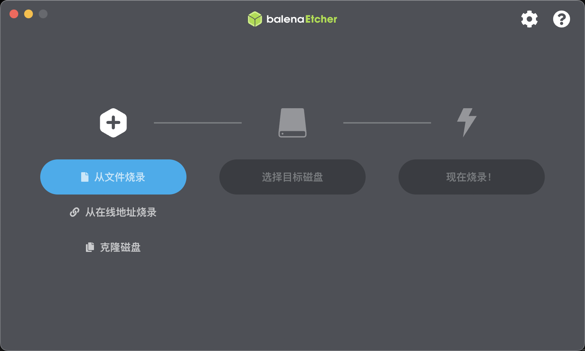
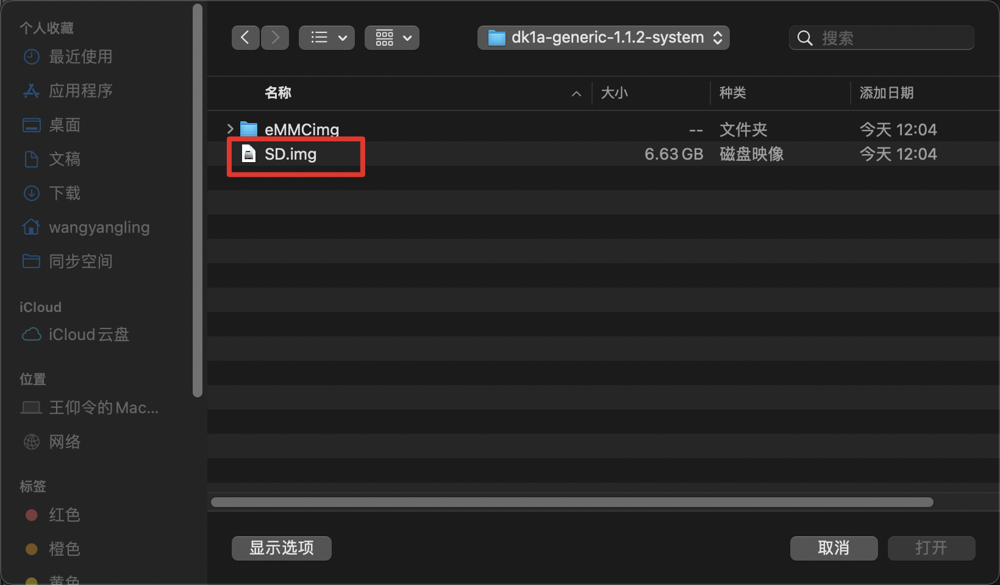
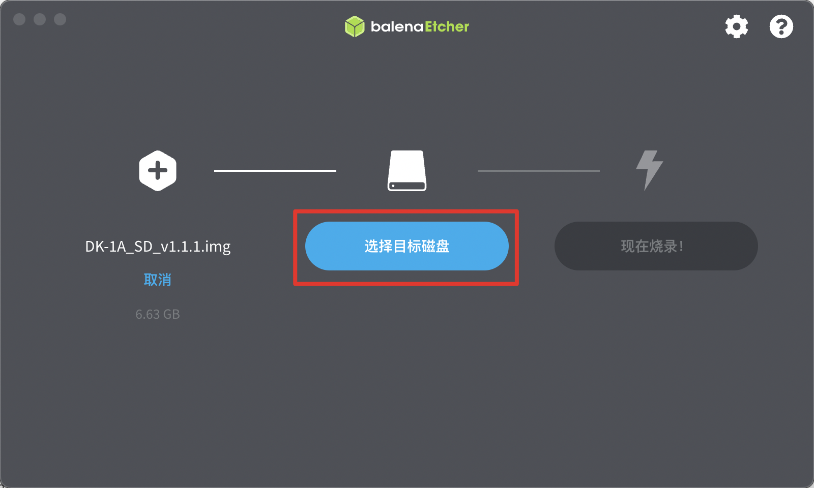
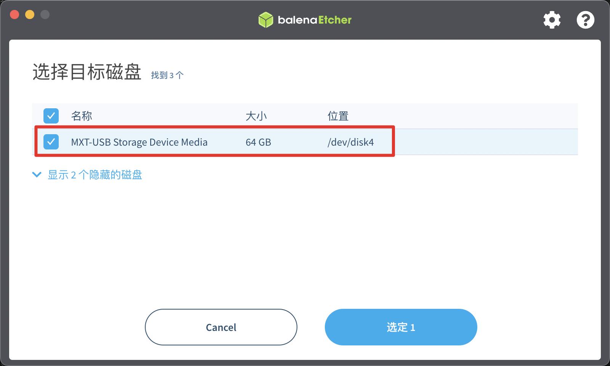
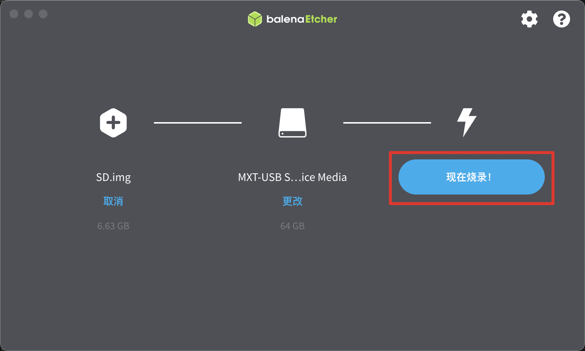
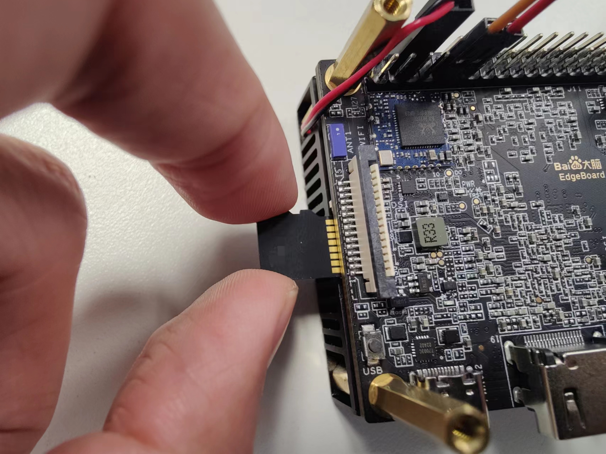

# 系统相关

默认内置系统：Ubuntu 20.04

## 系统版本查询

打开终端，输入命令

```shell
cat /etc/ppboard.ver
```

即可查看系统版本信息。

## 系统热更新

当提供版本过低时，可按照如下流程更新系统。
打开终端，输入命令

```shell
sudo apt update 
sudo apt install boot-image kernel-image kernel-modules
```

重启板卡后，即可完成更新系统。可在终端中输入如下命令重启板卡。

```shell
sudo reboot
```

## 系统镜像烧写

默认版本eMMC内置系统镜像，即可直接使用eMMC引导启动系统。  

为满足部分用户需求，***PPOS1.1.2***之后版本并行提供MicroSD卡引导启动模式。  
优先级设定为：MicroSD卡引导启动模式 > eMMC引导启动模式，即插入有引导镜像的MicroSD卡时，优先使用MicroSD卡引导启动。  

两种引导启动模式烧写方法如下：

### eMMC引导启动模式-镜像烧写

#### 准备工作_eMMC

- 系统烧录工具 **SOC UBoot升级工具 V1.0.0.0** ，点击[此处](https://ruanyingyiti-deployrepo.bj.bcebos.com/jiaoyu/pp-os/vs680/tools/burn/SenarySocUpdateToolSetupV1.0.0.0.exe)下载，MD5：9be5c51ae01ec7fd02e32680e8f8f03f；  
- 更新镜像文件，下载地址[PPOSv1.2.2](https://ruanyingyiti-deployrepo.bj.bcebos.com/jiaoyu/pp-os/vs680/system/dk1a-generic-1.2.2-system.zip) ，MD5：0942589b24f5c06339e24d0e49735c47 ，并解压。  

**历史版本下载**  

<table>
    <thead>
        <tr>
            <th>发布日期</th>
            <th>版本名称</th>
            <th>下载链接</th>
            <th>MD5</th>
            <th>备注</th>
        </tr>
    </thead>
    <tbody>
        <tr>
            <td>2025.07.10</td>
            <td>PPOS1.2.2</td>
            <td><a href="https://ruanyingyiti-deployrepo.bj.bcebos.com/jiaoyu/pp-os/vs680/system/dk1a-generic-1.2.2-system.zip">点击下载</a></td>
            <td>0942589b24f5c06339e24d0e49735c47</td>
            <td>建议使用该版本</td>
        </tr>
        <tr>
            <td>2025.07.10</td>
            <td>PPOS1.2.2</td>
            <td><a href="https://ruanyingyiti-deployrepo.bj.bcebos.com/jiaoyu/pp-os/vs680/system/dk1a-generic-1.2.2-system.zip">点击下载</a></td>
            <td>0942589b24f5c06339e24d0e49735c47</td>
            <td>建议使用该版本</td>
        </tr>
        <tr>
            <td>2024.09.14</td>
            <td>PPOS1.2.1</td>
            <td><a href="https://ruanyingyiti-deployrepo.bj.bcebos.com/jiaoyu/pp-os/vs680/system/ppos_old/dk1a-generic-1.2.1-system.zip">点击下载</a></td>
            <td><a href="https://ruanyingyiti-deployrepo.bj.bcebos.com/jiaoyu/pp-os/vs680/system/ppos_old/dk1a-generic-1.2.1-system.zip">点击下载</a></td>
            <td>c0149b9cc1d5c4421ab83e3fd8267584</td>
            <td></td>
            <td></td>
        </tr>
        <tr>
            <td>2024.04.26</td>
            <td>PPOS1.2.0</td>
            <td><a href="https://ruanyingyiti-deployrepo.bj.bcebos.com/jiaoyu/pp-os/vs680/system/ppos_old/dk1a-generic-1.2.0-system.zip">点击下载</a></td>
            <td><a href="https://ruanyingyiti-deployrepo.bj.bcebos.com/jiaoyu/pp-os/vs680/system/ppos_old/dk1a-generic-1.2.0-system.zip">点击下载</a></td>
            <td>42fe10a395a7cc159068bf0d6e147a5a</td>
            <td></td>
        </tr>
        <tr>
            <td>2024.03.18</td>
            <td>PPOS1.1.2</td>
            <td><a href="https://ruanyingyiti-deployrepo.bj.bcebos.com/jiaoyu/pp-os/vs680/system/ppos_old/dk1a-generic-1.1.2-system.zip">点击下载</a></td>
            <td><a href="https://ruanyingyiti-deployrepo.bj.bcebos.com/jiaoyu/pp-os/vs680/system/ppos_old/dk1a-generic-1.1.2-system.zip">点击下载</a></td>
            <td>ab9f4de8096e25d306813263e8c61c0b</td>
            <td></td>
        </tr>    
        <tr>
            <td>2024.02.05</td>
            <td>PPOS1.1.1</td>
            <td><a href="https://ruanyingyiti-deployrepo.bj.bcebos.com/jiaoyu/pp-os/vs680/system/ppos_old/dk1a-generic-1.1.1-system.zip">点击下载</a></td>
            <td><a href="https://ruanyingyiti-deployrepo.bj.bcebos.com/jiaoyu/pp-os/vs680/system/ppos_old/dk1a-generic-1.1.1-system.zip">点击下载</a></td>
            <td>9a10b1008185d05e8c604781d84f9fcb</td>
            <td></td>
        </tr>
        <tr>
            <td>2024.01.10</td>
            <td>PPOS1.0.1</td>
            <td><a href="https://ruanyingyiti-deployrepo.bj.bcebos.com/jiaoyu/pp-os/vs680/system/ppos_old/dk1a-general-1.0.1-system.tgz">点击下载</a></td>
            <td><a href="https://ruanyingyiti-deployrepo.bj.bcebos.com/jiaoyu/pp-os/vs680/system/ppos_old/dk1a-general-1.0.1-system.tgz">点击下载</a></td>
            <td>597d979daf0fa591429f83f2ed9b7814</td>
            <td></td>
        </tr>
        <tr>
            <td>2023.11.22</td>
            <td>PPOS1.0.0</td>
            <td><a href="https://ruanyingyiti-deployrepo.bj.bcebos.com/jiaoyu/pp-os/vs680/system/ppos_old/dk1a-general-1.0.0-system.tgz">点击下载</a></td>
            <td><a href="https://ruanyingyiti-deployrepo.bj.bcebos.com/jiaoyu/pp-os/vs680/system/ppos_old/dk1a-general-1.0.0-system.tgz">点击下载</a></td>
            <td>673724fb20c2bcc08a81c2b99e6d3590</td>
            <td></td>
        </tr>
    </tbody>
</table>

#### Step1_eMMC

双击打开系统烧录工具 **SOC UBoot升级工具 V1.0.0.0** ，点击 **浏览** 按钮。


#### Step2_eMMC

在弹出的对话框中，选择解压后获得的更新镜像的文件夹 **eMMCimg** 文件夹，并点击 **选择文件夹** 按钮。


#### Step3_eMMC

<font color = "red">长按</font>板卡上的Reset按键<font color = "red">不放开</font>，使用USB TypeC连接线将开发板与电脑连接，此时程序识别到设备， **启动烧写** 按钮变绿，<font color = "red">再松开</font>Reset按键，点击启动烧写。


#### Step4_eMMC

弹出镜像路径确认对话框，确认后点击 **继续烧写** 按钮。


#### Step5_eMMC

烧写时长视镜像大小不同而异，一般耗时约5分钟。烧写完成后显示 **烧写完成（100%）** ，断开板卡与电脑连接，重新上电即可。


### MicroSD卡引导启动-镜像烧写

MicroSD卡引导启动需先完成eMMC镜像烧写，烧写完成后，再进行SD卡引导启动的镜像烧写，且需保持镜像版本号一致。

> **注意**：
>
> - MicroSD卡引导启动模式仅支持PPOS1.1.2及以上版本。

#### 准备工作_MicroSD

- 一张MicroSD卡，容量不低于16GB；

- SD卡烧录工具**balenaEtcher** ，点击[此处](https://etcher.balena.io/#download-etcher)选择合适的版本下载并安装；

- 更新镜像文件，同eMMC镜像下载包，详见[eMMC引导启动-准备工作](#准备工作_eMMC)；

#### Step1_MicroSD

将MicroSD卡插入电脑，并打开balenaEtcher；



#### Step2_MicroSD

在balenaEtcher界面中选择“从文件烧录”，并在对话框中选择解压后以.img尾缀的镜像文件；




#### Step3_MicroSD

点击“选择目标磁盘”按钮，选择SD卡所在盘符；





#### Step4_MicroSD

点击“现在烧录！”按钮，开始烧录；



#### Step5_MicroSD

等待烧录完成；


#### Step6_MicroSD

将SD卡从电脑中拔出，并插入到DK-1A的MicroSD卡槽中，通电即可正常开机启动。



## Samba文件共享

Samba是SMB协议的一种实现方法，主要用来实现Linux系统的文件共享和打印服务。Linux用户通过配置Samba服务器可以实现与mac/windows用户的资源共享。

DK-1A出厂默认配置了一个共享目录/home/edgeboard，创建文件使用的是edgeboard账户，客户端登录信息如下：  
> 默认用户名：edgeboard  
> 默认密码：1234

### 客户端使用

> 提示：使用前，检查板卡已经通过有线或者WiFi连接到电脑所在同一个局域网中。

#### Windows系统

Step1：打开 **资源管理器**，在地址栏中输入 \\\192.168.1.212 (DK-1A在局域网中的IP地址) , 如下图红框所示，按下回车键。


Step2：鼠标双击出现的edgeboard文件夹。  
Step3：在弹出登录对话框，输入用户名和密码，点击**确定**按钮，即可浏览板卡共享的目录。  


#### Mac系统

Step1：打开 **访达Finder**，在菜单栏中点击 **前往** -> **连接服务器**。


Step2：在弹出的对话框中，输入 smb://192.168.1.212 （DK-1A在局域网中的IP地址）, 点击 **链接** 按钮，如下图所示:


Step3：鼠标双击出现的edgeboard名称，弹出登录对话框，输入用户名和密码，点击确定，即可浏览DK-1A共享的目录。


