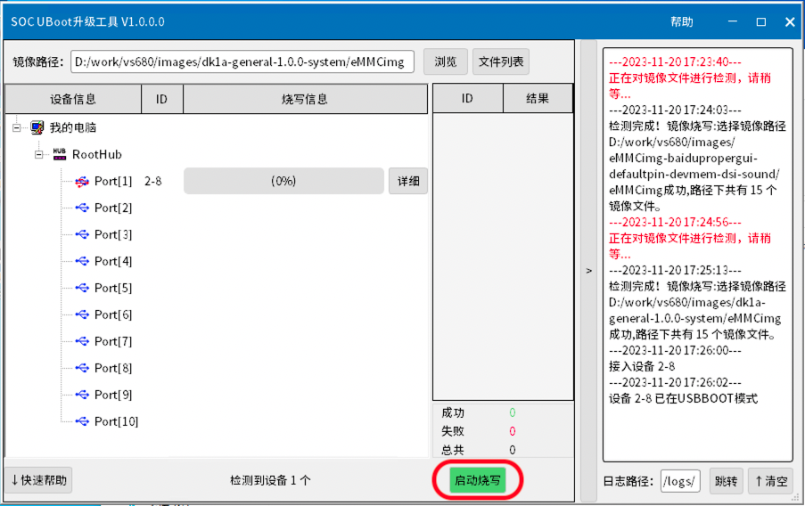
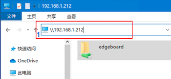
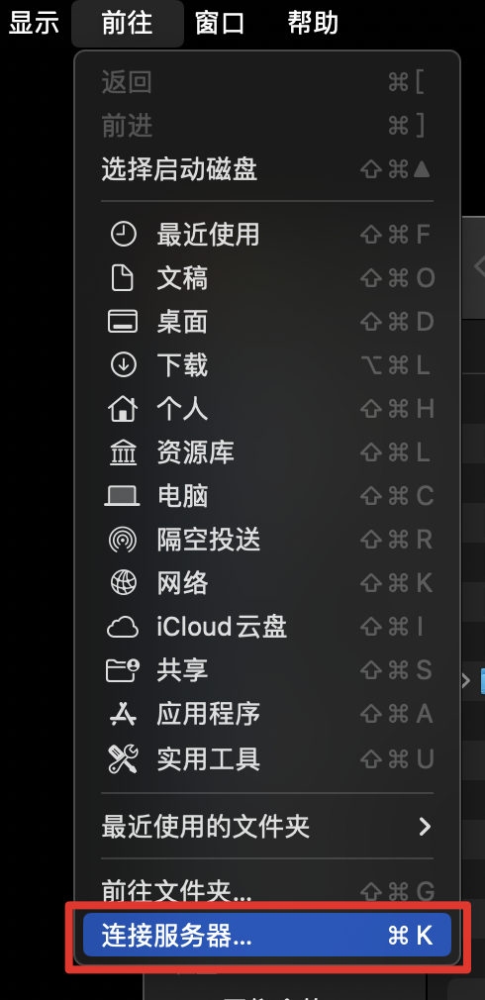
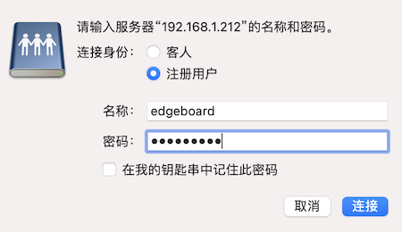

# 系统相关

默认内置系统：Ubuntu 20.04

## 系统版本查询

打开终端，输入命令

```shell
cat /etc/ppboard.ver
```

即可查看系统版本信息。

## 系统热更新

当提供版本过低时，可按照如下流程更新系统。
打开终端，输入命令

```shell
sudo apt update 
sudo apt install boot-image kernel-image kernel-modules
```

重启板卡后，即可完成更新系统。可在终端中输入如下命令重启板卡。

```shell
sudo reboot
```

## 系统镜像烧写

默认版本内置系统镜像

### 准备工作

- 系统烧录工具 **SOC UBoot升级工具 V1.0.0.0** ，点击[此处](https://pp-os.bj.bcebos.com/vs680/tools/burn/SenarySocUpdateToolSetupV1.0.0.0.exe)下载；  
- 更新镜像文件，下载地址[PPOSv1.1.2](https://pp-os.bj.bcebos.com/vs680/system/dk1a-generic-1.1.2-system.zip) ，MD5：ab9f4de8096e25d306813263e8c61c0b ，并解压。  

**历史版本下载**  

<table>
    <thead>
        <tr>
            <th>发布日期</th>
            <th>版本名称</th>
            <th>下载链接</th>
            <th>MD5</th>
        </tr>
    </thead>
    <tbody>    
        <tr>
            <td>2024.03.18</td>
            <td>PPOS1.1.2</td>
            <td><a href="https://pp-os.bj.bcebos.com/vs680/system/dk1a-generic-1.1.2-system.zip">点击下载</a></td>
            <td>ab9f4de8096e25d306813263e8c61c0b</td>
        </tr>    
        <tr>
            <td>2024.02.05</td>
            <td>PPOS1.1.1</td>
            <td><a href="https://pp-os.bj.bcebos.com/vs680/system/dk1a-generic-1.1.1-system.zip">点击下载</a></td>
            <td>9a10b1008185d05e8c604781d84f9fcb</td>
        </tr>
        <tr>
            <td>2024.01.10</td>
            <td>PPOS1.0.1</td>
            <td><a href="https://pp-os.bj.bcebos.com/vs680/system/dk1a-general-1.0.1-system.tgz">点击下载</a></td>
            <td>597d979daf0fa591429f83f2ed9b7814</td>
        </tr>
        <tr>
            <td>2023.11.22</td>
            <td>PPOS1.0.0</td>
            <td><a href="https://pp-os.bj.bcebos.com/vs680/system/dk1a-general-1.0.0-system.tgz">点击下载</a></td>
            <td>673724fb20c2bcc08a81c2b99e6d3590</td>
        </tr>
    </tbody>
</table>

### Step1

双击打开系统烧录工具 **SOC UBoot升级工具 V1.0.0.0** ，点击 **浏览** 按钮。


### Step2

在弹出的对话框中，选择解压后获得的更新镜像的文件夹 **eMMCimg** 文件夹，并点击 **选择文件夹** 按钮。


### Step3

<font color = "red">长按</font>板卡上的Reset按键<font color = "red">不放开</font>，使用USB TypeC连接线将开发板与电脑连接，此时程序识别到设备， **启动烧写** 按钮变绿，<font color = "red">再松开</font>Reset按键，点击启动烧写。




### Step4

弹出镜像路径确认对话框，确认后点击 **继续烧写** 按钮。


### Step5

烧写时长视镜像大小不同而异，一般耗时约5分钟。烧写完成后显示 **烧写完成（100%）** ，断开板卡与电脑连接，重新上电即可。


### Step6

开机后在终端输入命令以完成扩容。

```shell
sudo resize2fs /dev/mmcblk0p16
```

## Samba文件共享

Samba是SMB协议的一种实现方法，主要用来实现Linux系统的文件共享和打印服务。Linux用户通过配置Samba服务器可以实现与mac/windows用户的资源共享。

DK-1A出厂默认配置了一个共享目录/home/edgeboard，创建文件使用的是edgeboard账户，客户端登录信息如下：  
> 默认用户名：edgeboard  
> 默认密码：1234

### 客户端使用

> 提示：使用前，检查板卡已经通过有线或者WiFi连接到电脑所在同一个局域网中。

#### Windows系统

Step1：打开 **资源管理器**，在地址栏中输入 \\\192.168.1.212 (DK-1A在局域网中的IP地址) , 如下图红框所示，按下回车键。



Step2：鼠标双击出现的edgeboard文件夹。  
Step3：在弹出登录对话框，输入用户名和密码，点击**确定**按钮，即可浏览板卡共享的目录。  


#### Mac系统

Step1：打开 **访达Finder**，在菜单栏中点击 **前往** -> **连接服务器**。



Step2：在弹出的对话框中，输入 smb://192.168.1.212 （DK-1A在局域网中的IP地址）, 点击 **链接** 按钮，如下图所示:


Step3：鼠标双击出现的edgeboard名称，弹出登录对话框，输入用户名和密码，点击确定，即可浏览DK-1A共享的目录。


